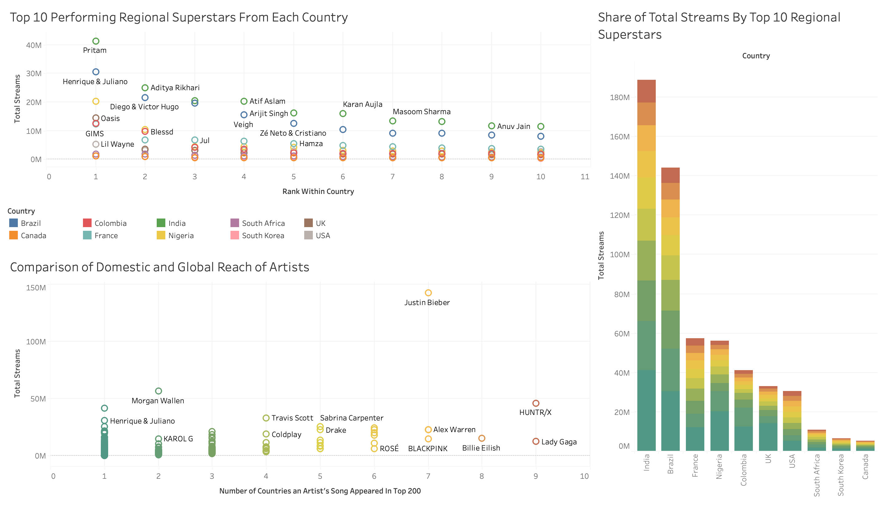
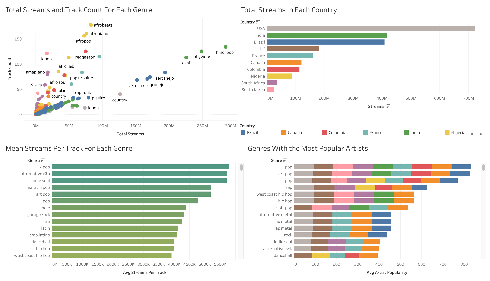

# Analysis of Spotify Global Trends

This project explores global and regional music trends by analyzing Spotify's Top 200 charts across ten countries. Using a pipeline built with Python, SQL, and Tableau, the project answers four key questions about genre popularity, global artist reach, and localized listening behaviors.
### Questions Answered
1. What genres are most popular in each country?
2. Which artists are producing the most globally popular music?
4. Which genres make artists the most popular?
5. Are there regional superstars who dominate locally but aren’t well-known globally?

---

## Tools and Technologies
- **Python** – For Spotify API integration and data enrichment (`spotipy`, `pandas`)
- **MySQL** – For data cleaning, transformation, and analytical queries
- **Excel/CSV** – For data exports and backups
- **Tableau** – For interactive dashboards and visual storytelling

---

## Project Workflow

### 1. Python: Data Collection & Enrichment
Used the Spotify API to:
- Scrape the Top 200 tracks for 10 countries
- Extract track metadata (artist names, track name, URI, chart rank)
- Enrich the dataset by retrieving artist-level information:
  - Genre(s)
  - Popularity score
  - Spotify track ID

**Output:** A clean, enriched CSV file (`spotify_enriched.csv`) with fields like `main_artist`, `artist_genres`, `artist_popularity`, and `streams`.

### 2. SQL: Cleaning & Analytical Queries
Using MySQL:
- Loaded the enriched CSV into a structured SQL table
- Cleaned genre fields (removing brackets, quotes, and exploding lists)
- Aggregated data to create:
  - Genre popularity by country and by continent
  - Global artist reach by number of countries
  - Localized artist dominance for “regional superstars”

SQL queries were organized in `Spotify_Project_MySQL.sql` and included several `JOIN`, `GROUP BY`, and `WINDOW FUNCTION` operations.

### 3. Excel: Data Export & Backup
Tables were exported into Excel to:
- Manually inspect for encoding issues (e.g., non-ASCII characters)
- Clean values where needed before final Tableau ingestion
- Create backup copies of key aggregates

### 4. Tableau: Dashboard Visualization
To visually answer our four key questions visualizations were built in Tableau and are displayed on my [Tableau Public Page](https://public.tableau.com/app/profile/matthew.david.ilomuanya/vizzes).

The dashboards include:
- Bar charts of genre popularity by country
- Bubble plots of artists' global reach
- Highlight tables of regional superstars with localized success

---

## Dashboards

---

## Key Insights

### Q1: Genre Popularity by Country
- Pop genres tended to dominate, with a pop variation appearing in the top 3 genres for all countries
- Brazil favors Funk and Latin genres, with it being the only country to not have a pop genre within it's top 3
- Songs tagged Afrobeat had the most in a single country making up 178 out of the top 200 songs

### Q2: Globally Popular Artists
- HUNTR/X and Lady Gaga appearing in 9/10 countries, no artist appeared in all 10
- Justin Bieber dominated by stream volume, having nearly 3 times as many streams as the next artist and appearing in 7/10 countries
- Morgan wallen was also the extremely dominant being the 2nd most streamed artist, despite only appearing in 2 music markets

### Q3: How Genre Popularity Affects Artists
- Pop genres produced the most popular artists when combinng popularity and reach with the top 3 being pop genres (pop, art-pop, k-pop)
- K-pop was particularly dominant, having the highest number of average streams per track of any genre
- Rap and Hip-Hop artists had saw the average popularity scores in individual markets, with South African rap having the highest in any market

### Q4: Regional Superstars
- India and Brazil had the most isolated music artists, with them having the highest proportion of streams taken up by regional superstars
- Pritam was particularly dominant making up approximately 10% of the total streams in India, and not appearing in any other top 200
- Burna Boy had the largest propoprtion though, taking up nearly 20% of the total streams in Nigeria

###### *note: some songs lacked a genre category, and were therefore left out of the genre level analysis
---

## Industry Specific Recommendations Based on the Data
### 1. Advertisers: Who to Partner With, Where, and Why?
**Observation:** Global stars like Justin Bieber are efficient for reach, but their ubiquity also means they operate in highly competitive, expensive advertising space. In contrast, regional superstars (e.g., Burna Boy in Nigeria, Pritam in India) deliver near-monopoly levels of cultural attention within their markets.

**Suggestion:** Instead of defaulting to global names, advertisers should evaluate share-of-attention concentration. Partnering with a regional artist who commands 10–20% of a country’s listening base provides outsized impact at lower cost. This creates competitive advantage in markets where brand clutter is otherwise low.

### 2. Record Labels: Where to Place Bets
**Observation:** K-pop demonstrates high efficiency in streams per track, not just popularity. This suggests its value is less about raw audience size and more about a business model that maximizes per-fan output through structured production and fandom economies.

**Suggestion:** Labels shouldn’t simply sign “the next K-pop group.” Instead, they should replicate the operational model—tight brand identity, multi-version releases, and fan monetization layers—in other under-exported genres (e.g., South African rap or Brazilian funk). This turns a genre into a scalable product system, not just a local trend.

### 3. Spotify: Where Growth Actually Lies
**Observation:** India, Brazil, and Nigeria have outsized cultural dominance of local artists but remain underdeveloped in streaming relative to population. This indicates that streaming growth in these countries is capped less by demand and more by infrastructure (payment systems, local playlisting, telecom partnerships).

**Suggestion:** For Spotify, the real opportunity isn’t just more playlists—it’s solving systemic barriers: bundling with telcos in Nigeria, hyper-local playlist curation in India, and differentiated pricing in Brazil.

### 4. Artists: How to Break Out Internationally
**Observation:** No single artist spans all 10 countries, highlighting the absence of a truly global act. Success is built stepwise: from local dominance → regional adjacency → global crossover.

**Suggestion:** For an emerging artist, the strategy is s**equencing market entry**. Begin with a cultural fit market (e.g., Afrobeats in Nigeria), use collabs to bridge into adjacent genres/regions (e.g., Afrobeats → Latin), and then secure a feature with a global act. What matters is not “who is big now” but how to construct a scalable career trajectory.

---
## Future Improvements
- Automate daily data pulls to detect trends over time 
- Integrate additional metadata (e.g., mood, tempo)
- Work around songs not having a genres

---

## Author
**Matthew-David Ilomuanya**  
Data Analyst & Researcher  
[LinkedIn](https://www.linkedin.com/in/matthew-david-ilomuanya-2498101a5/) | Portfolio Website

